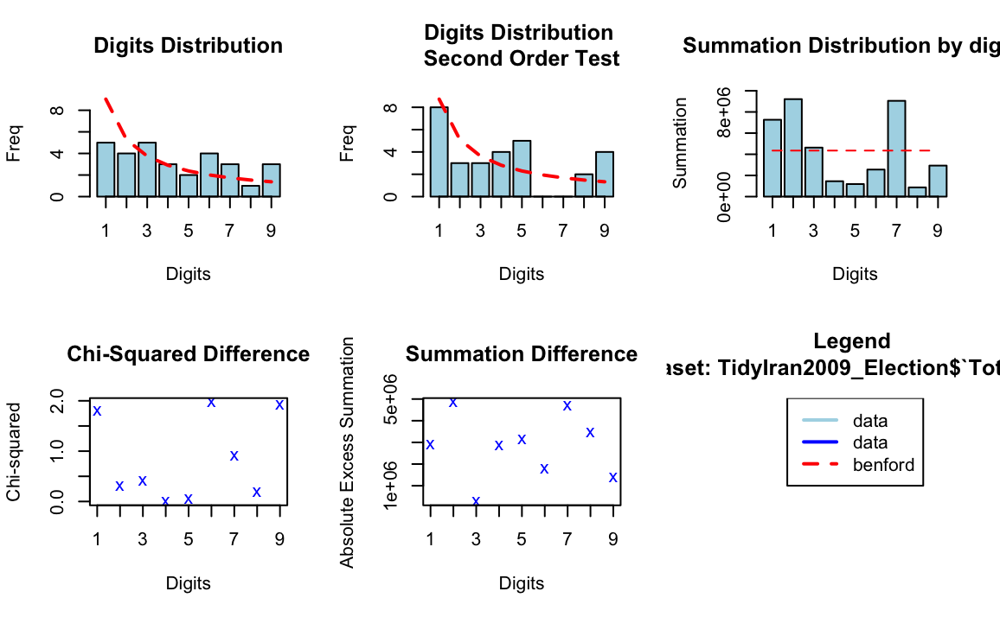

# Benford’s Law Election Analysis



## Project Overview
This project applies Benford’s Law analysis to election vote totals in order to examine numerical digit distributions and evaluate whether the observed data aligns with expected probabilistic patterns.

The analysis focuses on identifying deviations between observed leading-digit frequencies and theoretical Benford distributions using statistical visualization and comparative analysis techniques in R.

---

# Project Objectives
- Apply Benford’s Law to election data
- Compare observed digit frequencies to expected Benford distributions
- Evaluate deviations using graphical and statistical analysis
- Explore potential irregularities in numerical reporting patterns
- Visualize first-digit and second-order digit behavior

---

# Tools & Technologies
- R
- Benford.analysis
- ggplot2
- tidyverse
- Statistical Analysis
- Distribution Analysis
- Data Visualization

---

# Repository Structure

```text
Benfords-Law-Election-Analysis/
│
├── Data/
├── Images/
│   └── Distribution.png
│
├── Notebooks/
│   └── benford_iran_election.Rmd
│
├── Reports/
│
└── README.md
```

---

# Analysis Overview

The project evaluates:
- first-digit frequency distributions
- second-order digit tests
- summation distributions
- chi-squared differences
- absolute summation differences

Observed digit frequencies were compared against expected Benford probabilities to assess alignment and deviation patterns.

---

# Visualization Components

The dashboard includes:
- digit frequency distribution
- second-order Benford tests
- summation distribution analysis
- chi-squared difference plots
- absolute excess summation analysis

These visualizations help identify areas where observed values diverge from expected Benford behavior.

---

# Benford Distribution Analysis

The visualization below compares observed election digit frequencies against expected Benford distributions.


---

# Key Findings
- Lower digits appeared more frequently than higher digits, consistent with Benford expectations.
- Several digits demonstrated deviations from expected theoretical frequencies.
- Chi-squared and summation difference plots highlighted areas of statistical divergence.
- Second-order tests provided additional insight into numerical distribution behavior.
- Visual analysis demonstrated how Benford’s Law can be applied to real-world datasets for anomaly detection.

---

# Statistical Concepts Applied
- Benford’s Law
- First-digit distribution analysis
- Chi-squared analysis
- Summation testing
- Statistical anomaly detection
- Distribution comparison
- Exploratory statistical visualization

---

# Supporting Files

This repository includes:
- R Markdown notebooks
- Benford distribution visualizations
- statistical outputs
- exploratory analysis files

---

# Skills Demonstrated
- Statistical analysis
- Distribution analysis
- Benford’s Law application
- Exploratory data analysis
- R programming
- Data visualization
- Anomaly detection
- Quantitative reasoning

---

# Data

This project uses election vote count data for statistical digit distribution analysis using Benford’s Law methodologies.

The data was analyzed to compare observed digit frequencies against expected theoretical probability distributions.

---
# Author

Cameron Batts

GitHub: https://github.com/Cameron-Batts

Portfolio: https://cameron-batts.github.io

